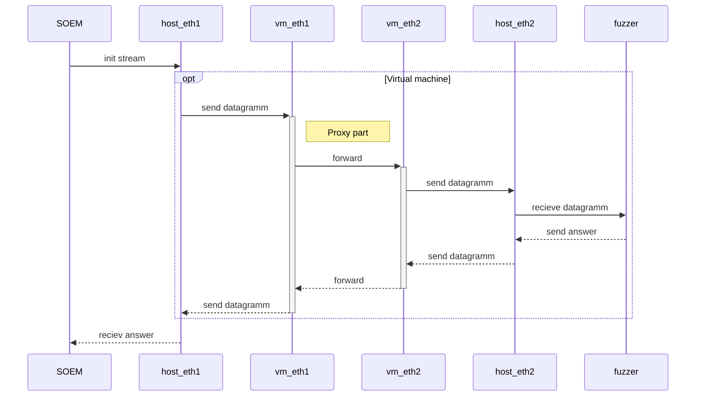

# EhterCat Master Proxy

Moved to gitlab

This proxy forward data from one net interface to another and back

```mermaid
sequenceDiagram
	SOEM      ->>  host_eth1: init stream

    opt Virtual machine
    host_eth1 ->>  +vm_eth1: send datagramm

    Note right of vm_eth1: Proxy part
    vm_eth1   ->>  +vm_eth2: forward
    vm_eth2   ->>  host_eth2: send datagramm
    host_eth2 ->>  fuzzer: recieve datagramm
    fuzzer    -->> host_eth2: send answer
    host_eth2 -->> vm_eth2: send datagramm
    vm_eth2   -->> -vm_eth1: forward
    vm_eth1   -->> -host_eth1: send datagramm
    end
    host_eth1 -->> SOEM: reciev answer
```
